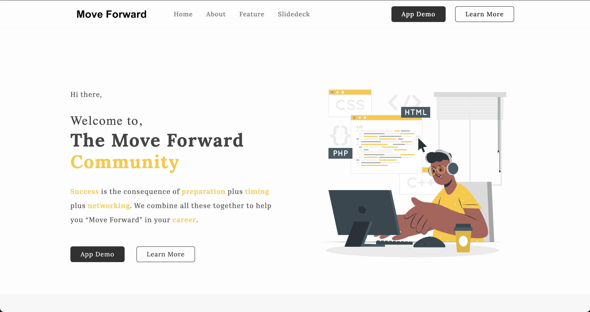

# Move Forward



How many times did you receive those emails saying "...will not move forward" from recruiters? Being in the job seeker myself, I faced many challenges during job search. Let's list a few of them:

- lack of preparation;
- absence of a clear career objective and plan;
- no centralized job application tracking system;
- no centralized career tracking system;
- etc.

The list can expand to several other challenges. **Move Forward**, as you have guessed is here to help you move forward in your job applications and career in general.

## Features

- User registration and authentication: this feature is the cornerstone without which the app can provide a personalized experience and recommendations;
- Job application record: this feature provides a detailed tracking capibilities and an analyze of the candidate's profile matching with the given job;
- more details below;

### Job application tracking system

The first way Move Forward tries to help is by providing a centralized job application system where you can keep track of all the jobs you've applied to or are interrested in. This way, you can keep all information about your applications (company, job description, qualifications, important dates, etc.) in a single place and always remember the important details when they'll call you for an interview. Yes, sometimes we forget the name of the company and even wonder who did apply to that job we've never heard about 😅?

### Career goal and objectives tracking

Save a clear career goal and set minimal objectives you can frequently track and assess. This data will be used in the coming versions to assess how you qualify for a particular job and offer custom recommendations to help you level up.

## Tech stack

- Mongo db running in docker container;
- Node.js, with TypeScript: A REST API to communicate with client apps;
- Mongoose, for the ODM;
- Jest, for testing;
- GitHub Actions, for continuous integration and automated testing;

## Installation

### Prequisites

Nothing crazy here:

- [docker-desktop](https://docs.docker.com/get-docker/);
- [node.js](https://nodejs.org/en);

### Project installation

Clone the project, install dependencies and run it:

```bash
git clone https://github.com/djimrangarleita/move_forward.git

cd move_forward

npm install

docker compose up --build

npm start
```

## Contributing

To contribute, fork this repository and propose a pull request. The prettier and eslint are setup to reformat your code and propose changes. Whenever you push a code, make sure the pipeline check all succeed before raising a PR.

## Related projects

- [Job Odyssey](https://github.com/christopherchoe/jobodyssey_hbtn);
- [Linkedin](https://www.linkedin.com/feed/);

## Coming soon

Keep refreshing this page, the shortcut is `F5`.

## References

- Project [landing page](https://djimrangarleita.github.io/move-forward-lp/)
- My [Linkedin](https://www.linkedin.com/in/djimra-ngarleita/)
